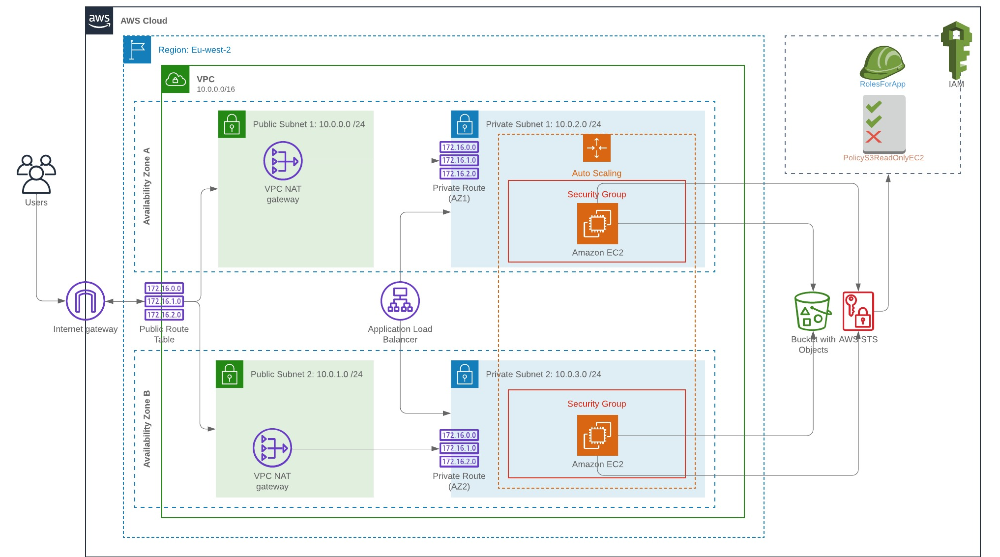

# Udagram-web-app-using-AWS-cloud-formation



In this project i created the infrastructure as a code with networking, to create and deploy high availability web app (Udagram App).

Just run
```sh
> ./create.sh UdagramApp infrastructure_networkandserver.yml infrastructure_networkandserver.json
```
URL:<br/>
```

```